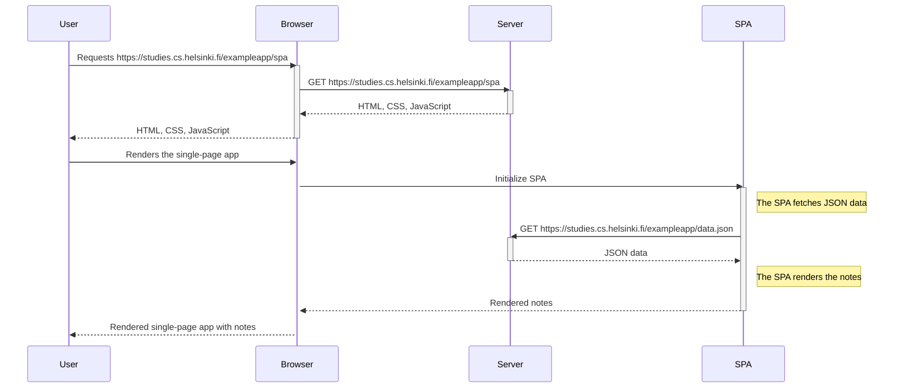

```mermaid
sequenceDiagram
    participant User
    participant Browser
    participant Server
    participant SPA

    User->>Browser: Requests https://studies.cs.helsinki.fi/exampleapp/spa
    activate Browser
    Browser->>Server: GET https://studies.cs.helsinki.fi/exampleapp/spa
    activate Server
    Server-->>Browser: HTML, CSS, JavaScript
    deactivate Server
    Browser-->>User: HTML, CSS, JavaScript
    deactivate Browser

    User->>Browser: Renders the single-page app
    activate Browser
    Browser->>SPA: Initialize SPA
    activate SPA

    Note right of SPA: The SPA fetches JSON data

    SPA->>Server: GET https://studies.cs.helsinki.fi/exampleapp/data.json
    activate Server
    Server-->>SPA: JSON data
    deactivate Server

    Note right of SPA: The SPA renders the notes
    SPA-->>Browser: Rendered notes
    deactivate SPA
    Browser-->>User: Rendered single-page app with notes
```
