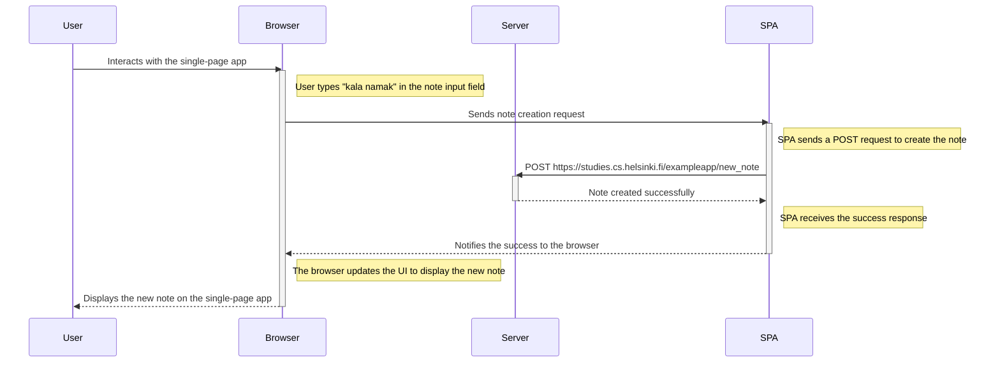

```mermaid
sequenceDiagram
    participant User
    participant Browser
    participant Server
    participant SPA

    User->>Browser: Interacts with the single-page app
    activate Browser

    Note right of Browser: User types "kala namak" in the note input field

    Browser->>SPA: Sends note creation request
    activate SPA

    Note right of SPA: SPA sends a POST request to create the note

    SPA->>Server: POST https://studies.cs.helsinki.fi/exampleapp/new_note
    activate Server
    Server-->>SPA: Note created successfully
    deactivate Server

    Note right of SPA: SPA receives the success response

    SPA-->>Browser: Notifies the success to the browser
    deactivate SPA

    Note right of Browser: The browser updates the UI to display the new note

    Browser-->>User: Displays the new note on the single-page app
    deactivate Browser
```
